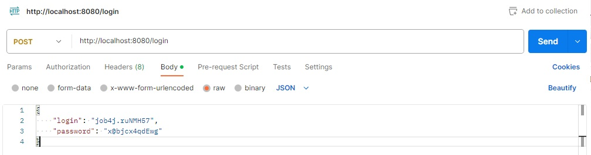

# проект "Сервис - UrlShortCut"

## О проекте 

Проект создан для освоения REST архитектуры.
Представляет из себя сервис для отслеживания посещяемости сайтов. Каждому сайту выдается пара логин и пароль.
Чтобы зарегистрировать сайт в систему нужно отправить запрос. Авторизация реализована через JWT.
Реализация REST API на Spring Boot 2.

## Стек технологий:

    Spring boot 2.7.6
    Thymeleaf 3.0.15
    Bootstrap 4.3.1
    Hibernate 5.6.11.Final
    PostgreSql 42.5.1
    Liquibase 4.15
    Lombok 1.18.22
    Java 17

## Требования к окружению:

    Java 17
    Maven 3.8
    PostgreSql 14

## Запуск проекта:

- скачать проект
- создать базу данных: ```create database url_shortcut;```
- запустить Main class, расположение: ru.job4j.urlshortcut

## Взаимодействие с приложением:

#### Взаимодействие с приложением происходит путем отправки запросов.
- Чтобы начать работу необходимо отправить POST запрос с именем сайта.

- В ответе мы получим сгенерированные логин и пароль.

#### Используя логин и пароль нам необходимо авторизоваться.


#### После авторизации и получения токена мы сможем зарегистрировать сайт по URL.

- В ответе мы получим уникальный код.

#### При отвравке GET запроса с уникальным кодом мы получим URL, привязанный к нему.


#### Мы можем посмотреть статистику по частоте запросов с помощью соответствующего запроса.


## Telegram для связи с разработчиком:

@Stanislav_Bogatyrev
[ссылка](https://t.me/Stanislav_Bogatyrev)